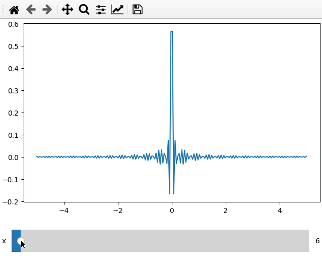
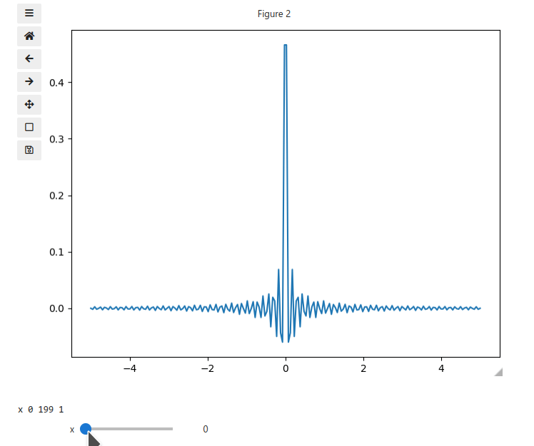
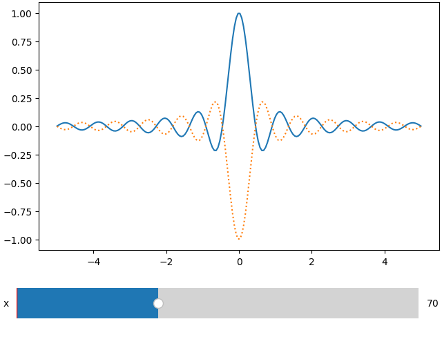
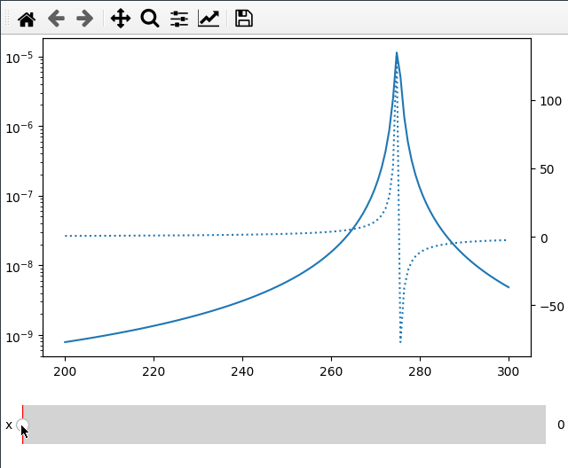
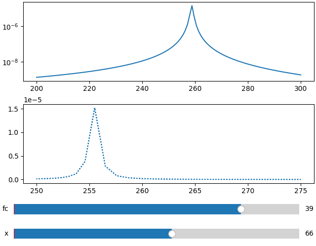
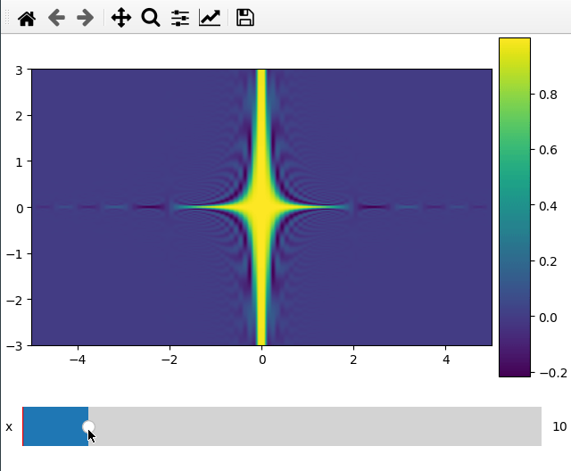
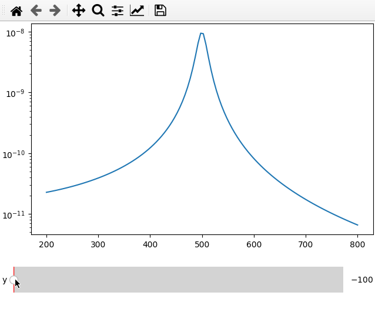

# Description    {#orgcfbe034}

In research we spend some time with plotting data, comparing measurement results
or testing the influence of parameter changes. Often the most intuitive approach
is by looking at different plots.
However, while python is great to create reproducible figures, I found no way to
quickly create plots with which one can interact without changing the code used
to create the plot as in *mathematica&rsquo;s* `Manipulate`. The closest one can get
to this is `interact` from `ipywidgets` which is limited to run in *Jupyter*
notebooks.

*Manipylate* shall provide the simplified functionalities from its bigger
sibling *Manipulate*. The tasks I had in mind while writing the tool are:

-   Plotting 1d and 2d cuts of multidimensional data and changing the slice index
    with sliders
-   Plot a function for changing parameters which one can modify interactively

I also wanted to keep things as simple as possible and be able to use
*manipylate* outside `jupyter` notebooks.

# Examples    {#org6401139}

First we get the environment ready (leave out the lines starting with `%` for
non-ipython shells).

    %matplotlib qt
    %load_ext autoreload
    %autoreload 2
    import matplotlib as mpl
    from matplotlib import pyplot as plt
    import numpy as np
    from manipylate import ifigure

    The autoreload extension is already loaded. To reload it, use:
      %reload_ext autoreload

## 1d cut through a 2d array    {#orgd8023d0}

Let&rsquo;s create some data:

    x = np.linspace(-5, 5, 200)
    X, Y = np.meshgrid(x, x)
    data = np.sinc(X * Y**2)

The figure is created by creating an `ifigure` object. We can then call its
`add_plot` method to add an axis and a line plot. Here `axpos` defines where the
plot shall be placed, `x` is the *x*-axis data. `data` the 2d array of which we
want to plot a cut along the axis given by `plot_ax`, and `parameters` is a list
of dimension parameters we want to change using sliders.

Calling `show` creates the figure. It needs to be called after all plots have been
added to the figure since here we&rsquo;ll create the sliders and arange the slider
axes (in case of execution outside jupyter).

    ifig = ifigure(1,1)
    ifig.add_plot(axpos=[0,0],x=x,data=data,parameters=['x'],plot_ax=1)
    ifig.show()

### In jupyter notebook    {#org5d117e1}

In order to use the `ipywidget` widgets, we call `ifigure` with the
`jupyterwidget` keyword argument.

    ifig = ifigure(1,1,jupyterwidget=True)
    ifig.add_plot(axpos=[0,0],x=x,data=data,parameters=['x'],plot_ax=1)
    ifig.show()

## Adding a second plot    {#orgcd0c493}

### In the same axis    {#org453b4be}

Axes are remembered by the `ifigure` object based on their position, so we can
call the same `add_plot` command with another dataset. Note that any keyword
arguments are passed to `matplotlib.axes.plot`, so we can use this to change the
line style.

    ifig = ifigure(1,1)
    ifig.add_plot(axpos=[0,0],x=x,data=data,parameters=['x'],plot_ax=1)
    ifig.add_plot(axpos=[0,0],x=x,data=-data,parameters=['x'],plot_ax=1,ls=':')
    ifig.show()

Note that here both plots share the same parameter. In the next example we will
see that if called with a different name, a new slider will be created.

### As twinned axis    {#org669d4aa}

Sometimes I want to compare two different values (like amplitude and phase) over
the same x axis. This can be done by passing the `twinx=True` to the `add_plot`
method. Here I also use the `fix_lim` flag to prevent the phase axis from
updating.
Note that `add_plot` returns a matplotlib axis instance which we can modify as
usual (here setting the y scale to logarithmic).

    fc = np.linspace(-5, 5, 50) ** 2 + 250
    x = np.linspace(200, 300, 120)
    FC, X = np.meshgrid(fc, x, indexing="ij")
    data = 1 / ((FC ** 2 - X ** 2 - 1j * X * 1) ** 2)
    
    ifig = ifigure(1, 1)
    ax = ifig.add_plot(axpos=[0, 0], x=x, data=np.abs(data), parameters=["fc"], plot_ax=1)
    ax.set_yscale("log")
    ifig.add_plot(
        axpos=[0, 0],
        x=x,
        data=np.angle(data, deg=True),
        parameters=["x"],
        plot_ax=1,
        twinx=True,
        ls=":",
        fix_lim=True,
    )
    ifig.show()

### As new axis    {#org3be9d22}

In order to add more than one subplots we adjust the `ifigure` creation.
Here we also use another parameter for the second plot.

    fc = np.linspace(-5, 5, 50) ** 2 + 250
    x = np.linspace(200, 300, 120)
    FC, X = np.meshgrid(fc, x, indexing="ij")
    data = 1 / ((FC ** 2 - X ** 2 - 1j * X * 1) ** 2)
    
    ifig = ifigure(2, 1)
    ax = ifig.add_plot(axpos=[0, 0], x=x, data=np.abs(data), parameters=["fc"], plot_ax=1)
    ax.set_yscale("log")
    ifig.add_plot(
        axpos=[1, 0],
        x=fc,
        data=np.abs(data),
        parameters=["x"],
        plot_ax=0,
        ls=":",
    )
    ifig.show()

## 2d cut trough nd array    {#org78e390e}

Plotting a 2d cut is nearly the same as a 1d line. `ifigure` creates an `imshow`
plot when being passed data which has two more dimensions than the number of
parameters passed to the function.
For the 2d plot we need to specify along which axes we want to cut by changing
the `plot_ax` argument to a list of length 2. 

    x = np.linspace(-5, 5, 200)
    y = np.linspace(-3, 3, 100)
    z = np.linspace(-4, 4, 80)
    X, Y ,Z = np.meshgrid(x, y, z,indexing='ij')
    data = np.sinc(X * Y**2 * Z**3)
    
    ifig=ifigure(1,1)
    
    ifig.add_plot(axpos=[0,0],x=[x,y],data=data,parameters=['x'],plot_ax=[0,1])
    ifig.show()

## Plotting a functions value    {#orgfc0fa1a}

The `data` argument can be replaced by a function that returns either a 1d
array for a line plot or a 2d array for a map plot. 

### In 1d    {#org6181e9c}

The main difference to calling the plot on an array is that we do not need to
specify the `plot_ax` parameter but we need to define a range and step size for
the slider, which is done by replacing the string argument in the parameter list
by a list containing name,minimum, maximum and step size.

    fc = 250
    x = np.linspace(200, 800, 120)
    def lor(y):
        return np.abs(1 / ((4*fc ** 2 - (x+y) ** 2 - 1j * x * 20) ** 2))
    
    ifig = ifigure(1, 1)
    ax = ifig.add_plot(axpos=[0, 0], x=x, data=lor, parameters=[["y",-100,100,1]])
    ax.set_yscale("log")
    ifig.show()

### In 2d    {#orgecf6d75}

## Complex figure layout    {#org04912c3}

Since the subplot layout creation is based on `GridSpec`, we can create more
complicated layouts. We use the handy `numpy.s_` to create the exact slices to
index the `GridSpec`.

    x = np.linspace(-5, 5, 200)
    y = np.linspace(-3, 3, 100)
    z = np.linspace(-4, 4, 80)
    X, Y ,Z = np.meshgrid(x, y, z,indexing='ij')
    data = np.sinc(X * Y**2 + Z)
    
    ifig = ifigure(6, 4,figsize=(12,8))
    ax=ifig.add_plot(axpos=np.s_[0,:], x=x, data=data, parameters=["y",'z'],plot_ax=0)
    ax.set(xlabel='x')
    ax=ifig.add_plot(axpos=np.s_[1,:2], x=y, data=data, parameters=["x","z"],plot_ax=1)
    ax.set(xlabel='y')
    ax=ifig.add_plot(axpos=np.s_[1,2:], x=z, data=data, parameters=["x","y"],plot_ax=2)
    ax.set(xlabel='z')
    ax=ifig.add_plot(axpos=np.s_[2::,:], x=[x,z], data=data, parameters=["y"],plot_ax=[0,2])
    ax.set(xlabel='x',ylabel='y')
    ifig.show()

# TODOs    {#org559ccb3}

## TODOs    {#org1148660}

-   Comment and document code
-   

## Bugs    {#org21e1a00}

## Missing Features    {#org86312c1}

-   add `convert_param` method to display physical parameter values (e.g. 0-1μm
    instead of index values 1-51)
-   3d plots ?
-   choice for 2d plots (contour)

